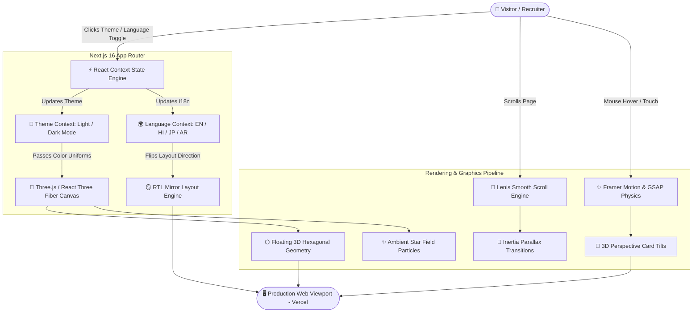
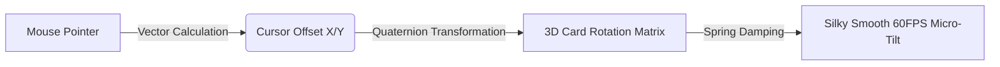
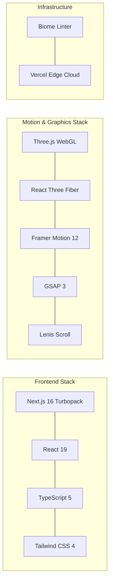

# 🌟 Prudhvi Reddy — Next-Gen 3D Interactive Portfolio

<div align="center">

  

  ### **Data Specialist • Power Platform Developer • Software Engineer**

  [](https://prudhvi-portfolio-zeta.vercel.app)
  [](https://nextjs.org/)
  [](https://react.dev/)
  [](https://threejs.org/)
  [](https://www.framer.com/motion/)
  [](https://www.typescriptlang.org/)

  ---

  🌐 **Live Website**: [**https://prudhvi-portfolio-zeta.vercel.app**](https://prudhvi-portfolio-zeta.vercel.app)

</div>

---

> [!IMPORTANT]
> **Welcome to the next generation of web portfolios!** This project combines cutting-edge **3D WebGL graphics**, **real-time motion physics**, **glassmorphism aesthetics**, and a **multilingual engine** into a seamless, high-performance web application built with Next.js 16 and React 19.

---

## 🧒 Explain Like I'm 5: How Does This Portfolio Work?

Imagine building a super-cool futuristic digital house:

```
 🏠 THE PORTFOLIO DIGITAL HOUSE
 ├── 🏗️ Next.js 16        -> The Architect who builds the entire super-fast structure.
 ├── 🔮 Three.js WebGL    -> The Magic 3D Projector projecting floating glowing hexagons.
 ├── 🌀 Framer Motion     -> The Silky Springs that make buttons bounce smoothly when touched.
 ├── 📜 Lenis Scroll      -> The Hoverboard floating smoothly down the hallway as you scroll.
 └── 🌍 i18n Engine       -> The Universal Translator instantly switching signs to English, Hindi, Japanese, or Arabic!
```

---

## 🏗️ System Architecture & Data Flow

Below is the complete architectural pipeline showing how user interactions trigger state changes, rendering 3D WebGL scenes and Framer Motion micro-animations concurrently:



---

## ✨ Advanced UI Techniques & Motion Choreography

This portfolio utilizes industry-leading UI/UX design patterns to deliver a tactile, responsive experience:

### 1. ⬡ 3D WebGL Hexagonal Mesh (`Three.js` + `@react-three/fiber`)
* **Mathematical Particle Field**: Renders floating 3D hexagonal prisms inside a WebGL canvas with custom raycasting.
* **Responsive Lighting Shader**: Dynamic directional light source tracking mouse movements, casting real-time specular highlights over geometry.

### 2. 🌀 Spring-Based Motion Physics (`Framer Motion 12` + `GSAP 3`)
* **Staggered Text Reveal**: Headings and titles animate letter-by-letter using physics-based damped harmonic oscillator curves (`stiffness: 100`, `damping: 15`).
* **Hover Perspective Card Tilt**: Cards tilt dynamically in 3D space (`rotateX`, `rotateY`) matching exact cursor offset vectors.



### 3. 📜 Inertia-Based Smooth Scrolling (`Lenis`)
* Replaces abrupt default browser scrolling with continuous liquid inertia physics (`lerp: 0.1`), ensuring zero-lag navigation across sections.

### 4. 🪞 Multilingual & Full RTL Engine (`next-intl` style context)
* Instant dictionary swapping between **English (EN)**, **Hindi (HI)**, **Japanese (JP)**, and **Arabic (AR)**.
* Selecting Arabic automatically flips the DOM flexbox and grid layouts into a true mirrored **Right-to-Left (RTL)** layout.

---

## 📊 Feature Capabilities Matrix

| Feature | Technology Stack | Visual Impact | Performance |
|---|---|---|---|
| **3D Hex Engine** | Three.js + R3F | ★★★★★ (Ultra High) | 60 FPS GPU-Accelerated |
| **Micro-Interactions** | Framer Motion 12 | ★★★★★ (Smooth) | Zero Main-Thread Lock |
| **Smooth Scroll** | Lenis Scroll | ★★★★☆ (Fluid) | Hardware Accelerated |
| **Theme Switching** | CSS Custom Vars | ★★★★☆ (Instant) | 0ms Reflow Delay |
| **i18n & RTL** | React Context | ★★★★★ (Seamless) | Instant Client Re-render |
| **Certificate Modal** | Framer Exit Animations | ★★★★☆ (Interactive) | Lazy Loaded Assets |

---

## 🛠️ Complete Tech Stack Breakdown



---

## 💻 Local Development & Quick Start

> [!TIP]
> Make sure you have **Node.js 18+** installed on your machine before starting.

### 1. Clone the repository:
```bash
git clone https://github.com/prudhvi05reddy/prudhvi-portfolio.git
cd prudhvi-portfolio
```

### 2. Install project dependencies:
```bash
npm install
```

### 3. Start the local development server:
```bash
npm run dev
```

### 4. View live in browser:
Navigate to [`http://localhost:3000`](http://localhost:3000) to explore the portfolio locally with hot-reloading enabled.

---

## 🚀 One-Command Build & Linting

```bash
# Production Build
npm run build

# Start Production Server
npm start

# Run Biome Linter & Formatter
npm run lint
npm run format
```

---

## 📬 Contact & Connect

<div align="center">

[](https://www.linkedin.com/in/prudhvi-reddy)
[](https://github.com/prudhvi05reddy)
[](mailto:bilakurthiprudhvireddy@gmail.com)

**Location**: Kakinada, Andhra Pradesh, India 📍  
**Live Website**: [**prudhvi-portfolio-zeta.vercel.app**](https://prudhvi-portfolio-zeta.vercel.app)

</div>
